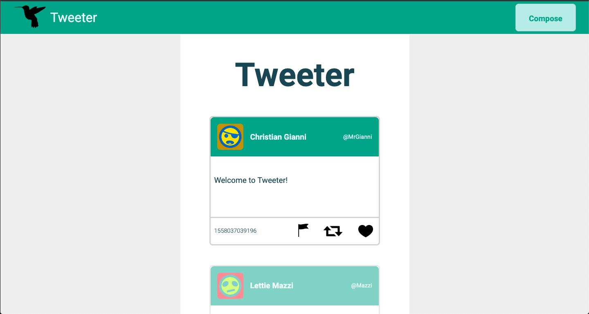
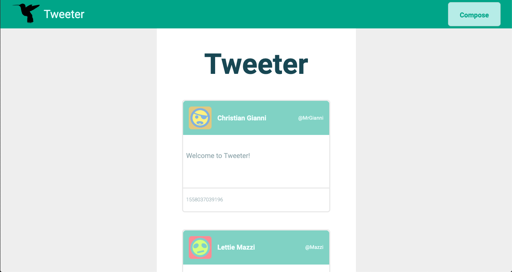
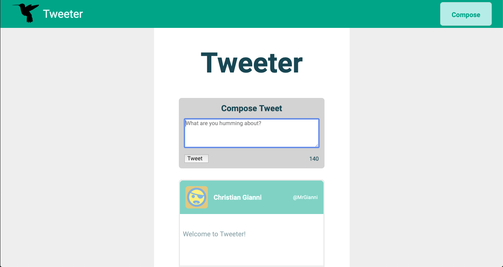

# Tweeter Project

Tweeter is a simple, single-page AJAX-based Twitter clone that uses jQuery, HTML5, CSS3, and Javascript. Wow! It was developed in the April 29th Lighthouse Labs cohort.

## Getting Started

1. Fork this repository, then clone your fork of this repository.
2. Install dependencies using the `npm install` command.
3. Start the web server using the `npm run local` command. The app will be served at <http://localhost:8080/>.
4. Go to <http://localhost:8080/> in your browser.

## Screenshots

## Dependencies

- Express
- Node 5.10.x or above 
- Body-parser
- Chance
- MD5
- Mongo
